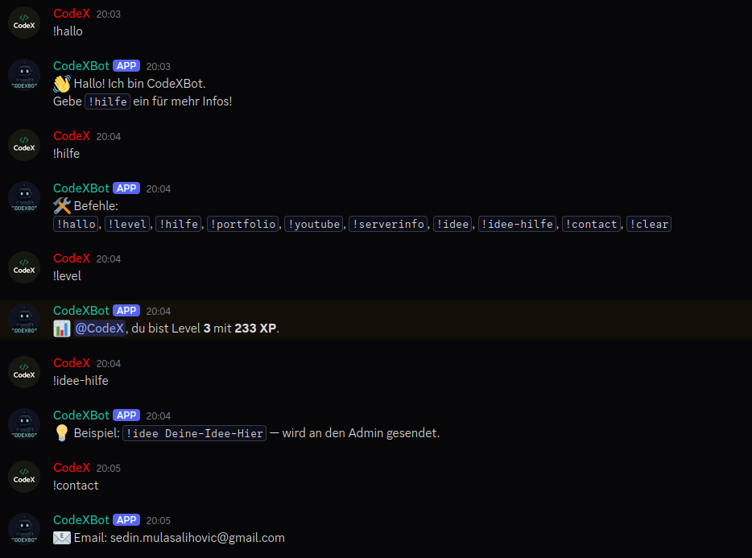

# 🤖 CodeXBot


CodeXBot is a multifunctional **Discord bot** designed to make your server more fun, organized, and interactive.  
With **leveling**, **admin tools**, and **custom commands**, it’s perfect for coding communities, gaming servers, and friend groups.

---

## ✨ Features
- 🎯 **Level System** – Gain XP and level up by chatting.
- 🧹 **Clear Command** – Delete up to 100 messages with one command.
- 📊 **Server Info** – Get details about your server.
- 💡 **Idea System** – Submit suggestions directly to the admin.
- 📂 **Portfolio Command** – Share your portfolio.
- 📺 **YouTube Command** – Promote your YouTube channel.
- 🤝 **Welcome Messages** – Automatic greetings for new members.
- 🛠 **Help Command** – Shows all available commands.
- 🤖 **AI Mode (optional)** – Ask coding questions and get instant help.

---

## 📜 Commands
| Command         | Description |
|-----------------|-------------|
| `!hallo`        | Greets the user. |
| `!hilfe`        | Shows all commands. |
| `!level`        | Displays your current level and XP. |
| `!portfolio`    | Sends the portfolio link. |
| `!youtube`      | Sends the YouTube channel link. |
| `!serverinfo`   | Shows server details. |
| `!idee`         | Submit an idea to the admin. |
| `!idee-hilfe`   | Shows how to use the idea command. |
| `!contact`      | Shows the bot owner’s contact email. |
| `!clear <n>`    | Deletes the last **n** messages (admin only). |

---

## 🖼️ Screenshot 


---

## ⚙️ Installation
1. **Clone this repository:**
   ```bash
   git clone https://github.com/Sedin-Mulasalihovic/codexdc.git
   cd codexdc
2. **Install dependencies:**
   ```bash
   npm install
3. **Create .env file:**
   ```bash
   TOKEN=your_discord_bot_token
4. **Run the bot:**
   ```bash
   node index.js
---
## 🔒 Permissions
**Make sure your bot has these permissions:**
- Manage Messages
- Send Messages
- Read Message History
---
## 👤 Author

**Sedin Mulasalihovic**
- 🌐 Portfolio https://sedin-mulasalihovic.github.io/portfolio/
- 📧 sedin.mulasalihovic@gmail.com
